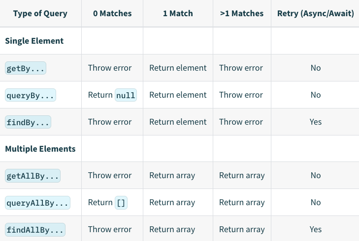

# Queries

- To select a single DOM element, you can use the ```getBy```, ```findBy```, or queryBy query
- To select multiple DOM elements, you can use the ```getAllBy```, ```findAllBy``` or ```queryAllBy``` query
- ```getBy``` and ```findBy``` return an error if there is no match or more than one match
- queryBy returns null if there is no match and returns an error if there is more than one match
- ```findBy``` works well with asynchronous code but not with ```getBy``` and ```queryBy```
- ```getAllBy``` returns an error if there is no match and returns an array of matches for one or more than one match
- ```findAllBy``` returns an error if there is no match and returns an array of matches for one or more than one match
- ```queryAllBy``` returns an empty array for no match and returns an array of matches for one or more than one match

# What Not to Test with the Testing Library
- Internal state of a component
- Internal methods of a component
- Lifecycle methods of a component
- Child components